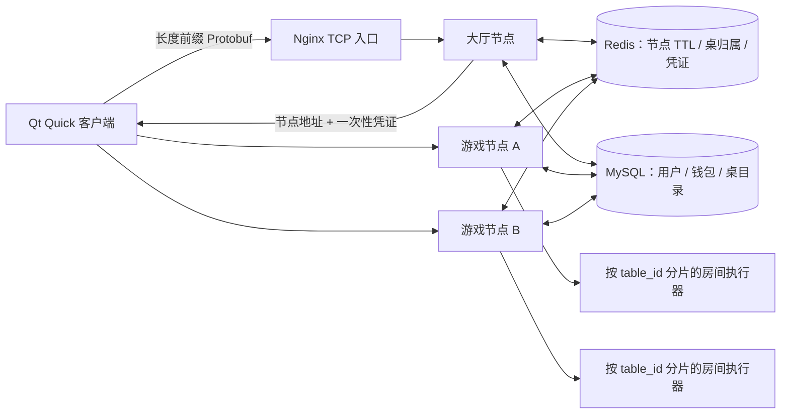
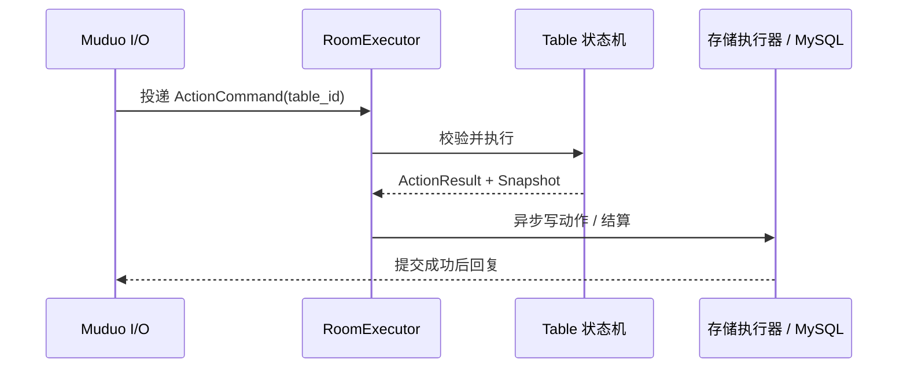

# 架构与并发

## 运行时结构

`standalone` 在一个进程内同时提供大厅和游戏能力。`lobby` 只接收建桌、列桌和路由命令；`game` 只执行入座和牌局命令。

## 服务端分层

| 层 | 职责 | 不允许做的事 |
|---|---|---|
| `net` | Muduo 连接、长度解码、包限制、令牌桶、发送 | 修改牌局或等待数据库 |
| `protocol` | Protobuf、消息类型和错误码 | 保存业务事实 |
| `application` | 鉴权、命令调度、房间执行器、超时 | 让多个线程同时写一张桌 |
| `domain` | 纯 C++ 规则、牌型、下注、边池、结算 | 依赖 Muduo、MySQL、Redis |
| `storage` | 账户、钱包托管、牌局历史和事务退款 | 把 Redis 当账本 |
| `cluster` | 节点 TTL、全局桌号、桌归属、短期凭证 | 转发下注或复制牌局状态 |
| `observability` | 健康检查、Prometheus 指标 | 记录密码、令牌或隐藏牌 |

## 单写者房间模型

Muduo I/O 线程只完成收包、解帧、反序列化和投递。`RoomExecutor` 对 `table_id` 取模，将同一桌的所有命令固定到同一逻辑分片并串行执行。

这样避免了给玩家、底池、行动位分别加锁，也不会出现两个线程同时结算同一手牌。动作结果、当前玩家私有视图和全量审计快照在同一个房间任务中原子生成。凡是跨越 MySQL 的桌命令还会持有一个异步持久化栅栏：数据库确认前，同桌后续写命令返回 `CONFLICT`，不同桌仍能并行。

## 事实来源

| 数据 | 事实来源 | 故障行为 |
|---|---|---|
| 用户、密码哈希、会话 | MySQL | 新认证失败关闭 |
| 钱包、桌上筹码、账本 | MySQL 事务 | 金融变更失败关闭 |
| 进行中牌局 | 唯一游戏节点 | 只重连原节点 |
| 开局筹码和牌局历史 | MySQL | 节点失败时退款依据 |
| 节点健康、桌归属、加入凭证 | Redis TTL | 不健康节点不接新桌 |
| 客户端当前画面 | 服务端个性化快照 | 本地状态必须被快照覆盖 |

MySQL 连接归还池前统一回滚残留事务并恢复自动提交；健康检查或借出时发现断链，会用配置中的连接超时显式建立替代连接，避免数据库短暂重启后池中永久残留失效句柄。

Redis Pub/Sub 没有用于下注或结算。权威牌局永远不跨节点共同写入。

节点负载使用 MySQL 中归属于该节点的开放桌数量，而不是只看已经加载进内存的桌。大厅分配新桌的 Lua 脚本会在写归属键时原子增加 Redis 预估负载，下一次两秒心跳再用 MySQL 计数校准，因此一批快速建桌不会全部落到排序靠前的节点。

## 背压与生命周期

- 单包上限由 `POKER_MAX_FRAME_BYTES` 控制。
- 每连接令牌桶限制瞬时和持续请求速率。
- Muduo 发送缓冲超过 `POKER_MAX_PENDING_SEND_BYTES` 时主动断开慢消费者，避免广播快照无限堆积。
- 存储线程池和房间队列有界；满载时返回 `SERVICE_UNAVAILABLE`。
- 幂等缓存容量不足时只淘汰已完成响应，绝不淘汰仍在执行的请求。
- 回调捕获共享连接会话，异步响应通过 Muduo 的线程安全发送路径回到连接事件循环。
- 同一用户在同一节点只保留一条活动连接，新连接会关闭旧连接。

## 安全边界

- 密码使用 libsodium Argon2id；不存在的用户也执行一次虚拟哈希校验以缩小登录计时差异；源码和镜像不含数据库口令。
- 会话令牌来自安全随机源，数据库只保存 SHA-256 摘要。
- 所有业务 SQL 使用预处理语句。
- Fisher–Yates 洗牌使用安全随机源；测试可注入固定牌堆。
- 日志只记录 ID、节点和错误，不记录密码、原始令牌或未公开底牌。
- 当前 Compose 为明文开发入口，公网 TLS 必须在部署层补齐。
