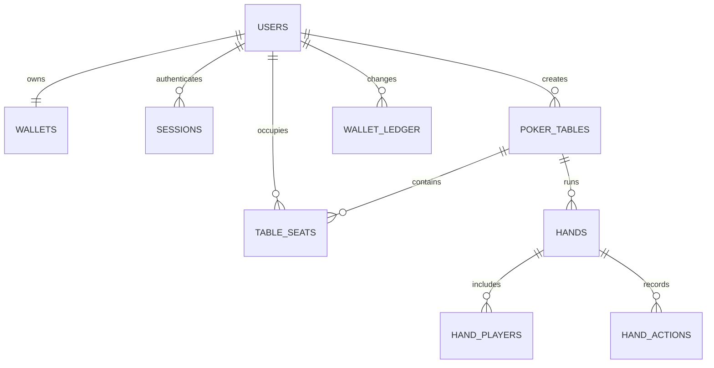

# 数据库设计

## 关系

完整建表语句位于 `deploy/mysql/init/001_schema.sql`。

## 关键表

- `users`：用户名和 Argon2id 编码哈希。
- `wallets`：桌外虚拟筹码与乐观版本号。
- `wallet_ledger`：不可变增减记录；`(user_id, idempotency_key)` 唯一。
- `sessions`：SHA-256 令牌摘要、过期时间和撤销时间；刷新用带旧摘要、用户和未过期条件的单条 `UPDATE` 原子轮换摘要。
- `poker_tables`：盲注、买入范围、所属节点和状态。
- `table_seats`：桌上筹码与本手开局筹码快照。
- `hands` / `hand_players`：公共牌、投入、赢取、结束筹码和底牌历史。
- `hand_actions`：动作顺序与 `(hand_id, user_id, request_id)` 唯一键。

## 钱包边界

买入在一个事务内完成：锁钱包、验证余额、插入座位、扣钱包、写账本。兑出反向执行。重复幂等键直接返回第一次结果。

开局先保存每位参与者的 `hand_start_stack`。结算在一个事务内更新手牌、玩家结果、桌上筹码和桌状态；同一持久化手牌 ID 只能结算一次。

整桌中止也在一个事务内完成：锁定桌状态、退回所有桌上筹码、逐用户写入唯一 `crash_refund` 账本、把未完成手牌标为 `aborted`、删除座位并关闭桌。重复执行会识别已经中止的桌并直接成功，不会重复退款。

持久化手牌 ID 使用 `table_id << 32 | hand_number`，协议内的 `hand_id` 仍是桌内递增编号。桌号由 Redis `INCR` 全局分配并限制在 32 位范围内。

## 索引理由

- 用户名、会话摘要、钱包幂等键均唯一，既加速查找也承担业务约束。
- `(game_node_id, status)` 支持节点故障回收。
- `(table_id, hand_number)` 防止同桌重复手牌。
- `(hand_id, action_sequence)` 固定动作顺序，另一唯一键防重复请求。
