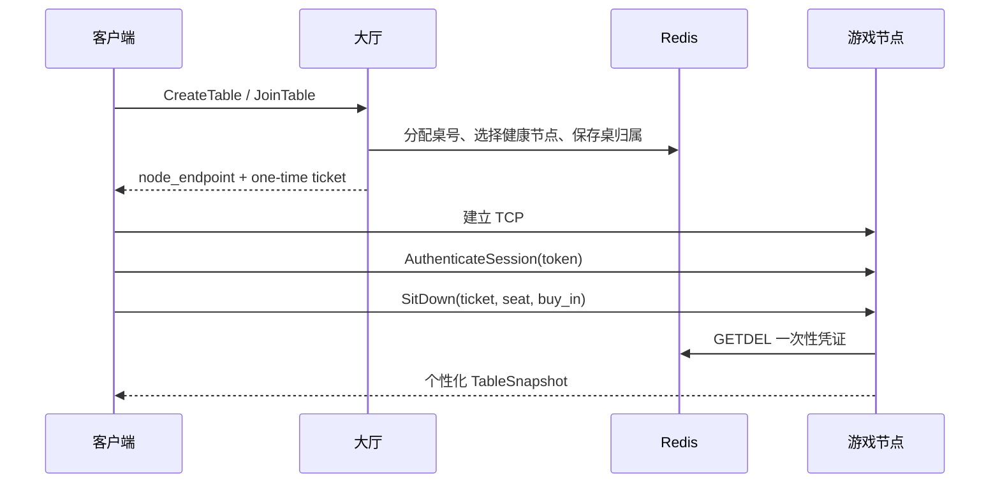

# 协议与重连

## TCP 帧

每条消息是 4 字节大端长度加一个序列化 `Envelope`：

```text
+------------------------------+-----------------------------+
| uint32 payload_size (BE)     | Protobuf Envelope           |
+------------------------------+-----------------------------+
```

长度不包含 4 字节头。空帧、超大帧或解码器进入失败状态后，服务端返回统一错误并关闭连接。单连接解码缓冲也限制为“最大帧长 + 4 字节”，防止攻击者在限流逻辑执行前用一次超大合并写入制造内存峰值。

客户端每 10 秒发送一次 `HEARTBEAT`，服务端回传客户端时间与服务端时间；默认连续 45 秒没有收到任何字节就关闭连接。阈值可由 `POKER_CONNECTION_IDLE_TIMEOUT_MS` 调整，Qt 客户端随后按指数退避重连并请求个性化桌快照。

`client_sequence` 以“用户在当前节点的新认证连接”为作用域。会话认证成功后双方都从 1 重新计数，因此节点重启后不会因服务端内存序列丢失而永久拒绝重连；同一连接禁止重复认证，防止借此清空幂等窗口并重放旧命令。服务端在每条认证后业务命令到达时检查会话到期时间；过期连接会失去用户绑定，桌内玩家被标记离线，客户端停止自动重连、清除旧令牌并回到登录页。

已认证连接可发送 `RefreshSessionRequest` 原子轮换当前令牌。旧令牌立即失效，过期时间从刷新时重新计算；刷新不重置 `client_sequence` 或内存幂等窗口，因此不能借它重放旧业务命令。

活跃游戏节点每两秒刷新本地桌的 Redis 归属 TTL。Redis 重启导致映射消失时，大厅只会在 MySQL 记录的原节点仍健康时重建映射，不会把一张桌改派给另一节点。

## Envelope 约束

- `protocol_version = 1`。
- 客户端 `request_id` 位于 `[1, 2^63-1]`；最高位留给服务端生成的超时动作 ID。
- 认证后的业务命令使用从 1 开始、严格递增的 `client_sequence`。
- 同一节点内重复 `request_id` 返回缓存响应，不重复扣筹码或行动。
- 桌事件带 `table_id`、`hand_id` 和递增 `server_sequence`。
- `message_type` 必须带对应消息体；缺失、未知和越权消息使用统一 `ErrorResponse`。

金融操作还有数据库幂等键，因此即使进程重启导致内存重放缓存丢失，相同买入或兑出请求也不会重复记账。

## 大厅到游戏节点



凭证带短 TTL 且只能消费一次。客户端不能用大厅连接直接下注，也不能在非所属游戏节点入座。

## 断线重连

同一游戏节点仍健康时，客户端重新连接、用现有会话认证，然后发送桌号、最后看到的 `server_sequence`。服务端重新绑定连接、标记玩家在线并返回完整个性化快照。

快照是唯一权威状态：客户端丢弃与它冲突的动画、倒计时和预测结果。自己底牌只发给自己；摊牌后只公开未弃牌玩家的底牌。

版本一不迁移进行中的牌局。所属节点失联超过保护窗口后，大厅回收器关闭桌并按 MySQL 记录退回桌上筹码。

## 下注金额

`BET` 和 `RAISE` 的 `target_street_commitment` 表示该玩家在当前街希望达到的总投入，不是增量。例如当前下注 100，加注到 300 应发送 `300`。`FOLD`、`CHECK`、`CALL`、`ALL_IN` 忽略该字段。

## 错误语义

| 错误 | 示例 |
|---|---|
| `INVALID_MESSAGE` | 版本、消息体、金额格式错误 |
| `UNAUTHENTICATED` | 会话缺失或过期 |
| `FORBIDDEN` | 错节点、错用户或凭证无效 |
| `OUT_OF_SEQUENCE` | 业务序号过期或跳号 |
| `RATE_LIMITED` | 单连接令牌耗尽 |
| `TABLE_RULE_VIOLATION` | 非当前玩家行动、加注不足 |
| `SERVICE_UNAVAILABLE` | 有界队列满、MySQL/Redis 不可用 |
