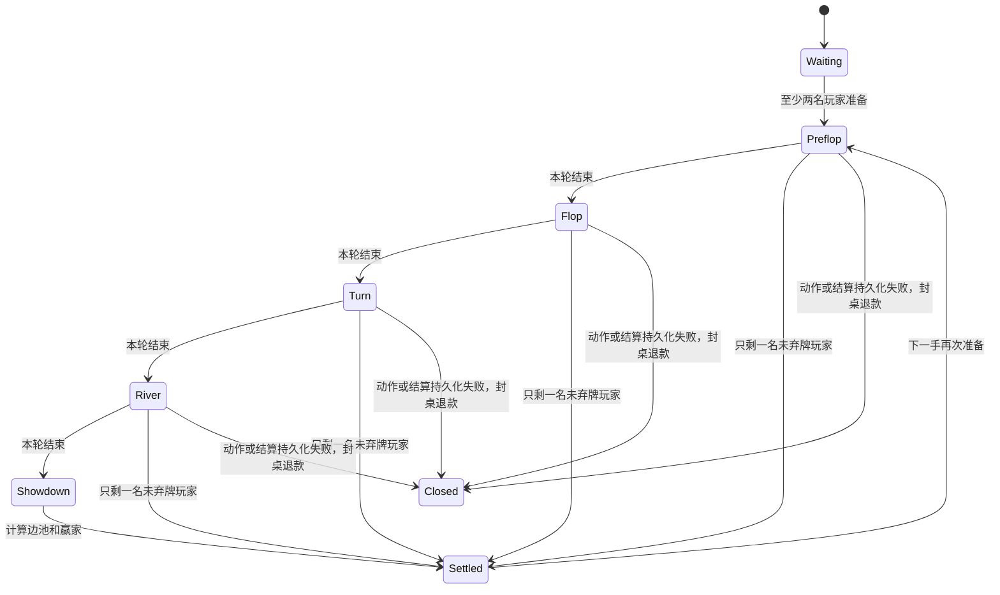

# 牌桌状态机与边池



当未弃牌者中至多一人还能行动，其余玩家均已全押时，服务端自动发完公共牌并结算。

## 行动不变量

- 只有 `acting_player` 能行动。
- 过牌要求个人当前街投入等于桌面当前下注。
- 普通下注/加注必须达到最小增量。
- 未达到完整最小增量的短全押可以提高跟注额，但不会为已经行动的玩家重新开放加注。
- 完整加注会重新要求其他仍可行动玩家表态。
- 弃牌玩家投入仍属于底池，但永远没有获胜资格。
- 一手牌只允许一次持久化结算，筹码总量在领域状态机内守恒。

## 多级边池

把所有非零累计投入排序去重为多个层级。每一层金额为：

```text
(当前层级 - 上一层级) × 投入不少于当前层级的人数
```

弃牌者计入贡献人数；只有未弃牌且投入达到该层级的人能竞争。每层独立比较七张牌最佳五张组合。

平局时先平均分配，无法整除的奇数筹码从庄家左侧开始顺时针逐枚分配。测试覆盖了多级全押、多人平分和庄家也在平局中的顺序。
