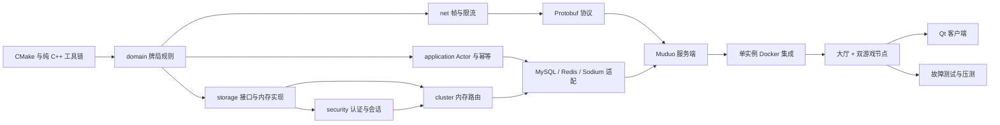

# Ubuntu 逐步学习与验证计划

> 目标：把当前仓库克隆到 Ubuntu 后，按依赖顺序学习、构建和验证每一层，最终做到可以独立解释、调试和继续开发。

## 1. 第一部分应该看什么

**先看并验证纯 C++ 领域层，第一份文件看 `include/poker/domain/card.hpp`，随后是牌堆、牌型判断，最后才是 `Table` 状态机。**

开始阶段不要先看 Muduo、MySQL、Redis、Docker 或 Qt。它们会同时引入网络、并发、外部依赖和部署问题，使你无法判断错误来自业务规则还是基础设施。

推荐阅读顺序：

1. [`card.hpp`](../include/poker/domain/card.hpp) 与 [`card.cpp`](../src/poker/domain/card.cpp)：牌的数据表示和不变量。
2. [`deck.hpp`](../include/poker/domain/deck.hpp) 与 [`deck.cpp`](../src/poker/domain/deck.cpp)：洗牌、抽牌和可注入随机源。
3. [`hand_evaluator.hpp`](../include/poker/domain/hand_evaluator.hpp) 与 [`hand_evaluator.cpp`](../src/poker/domain/hand_evaluator.cpp)：五张牌分类、七选五和比较规则。
4. [`table.hpp`](../include/poker/domain/table.hpp)：先只读公开接口、枚举、快照和错误码，不立即读实现。
5. [`table.cpp`](../src/poker/domain/table.cpp)：按“开局—行动—换街—边池—结算”的调用链分段阅读。
6. [`test_main.cpp`](../tests/test_main.cpp)：只读与上述模块对应的测试，用测试反推规则，不要一开始从头背完整测试文件。

领域层理解完成的判断标准：不看源码也能解释单挑盲注顺序、`target_street_commitment`、短全押为什么不重新开放加注、边池如何分层、奇数筹码为什么从庄家左侧开始发放。

## 2. 总依赖顺序



必须保持这个方向：内层不能反向依赖外层。例如 `domain` 不得包含 Muduo、MySQL、Redis、Protobuf 或 Qt 头文件。

## 3. 每个模块的学习方法

每个阶段都执行同一套五步法：

1. **读接口**：先读 `.hpp`，写下输入、输出、所有权和失败方式。
2. **写不变量**：例如“同一张牌不能出现两次”“同一房间只有一个写线程”“筹码总量守恒”。
3. **脱离源码复述**：画状态图或时序图，能口头讲清后再实现。
4. **自己手写**：关掉参考实现完成主体，再逐段对照当前仓库；不要复制后只改变量名。
5. **测试和提交**：本阶段测试通过后形成一个小 Git 提交，再进入下一阶段。

每完成一个模块，写一页学习记录：

```text
模块：
解决的问题：
对外接口：
核心不变量：
线程/对象所有权：
失败如何处理：
最容易写错的三个边界：
测试覆盖了什么：
如果重新设计会改什么：
面试时如何在两分钟内说明：
```

## 4. 阶段 0：获取项目并验证构建骨架

学习内容：Git 基线、现代 CMake target、Debug/Release、Ninja、CTest。

当前仓库推送到 GitHub 后，在 Ubuntu 终端获取项目：

```bash
git clone https://github.com/lwr-bot/Poker.git
cd Poker
git status
```

`git status` 应显示工作树干净。不要在来源不明的目录中执行删除或重置命令。

安装第一阶段最少依赖：

```bash
sudo apt update
sudo apt install -y build-essential cmake ninja-build git
```

检查内容：

- 根 [`CMakeLists.txt`](../CMakeLists.txt) 中的 C++17、构建选项和核心 target 结构。
- [`CMakePresets.json`](../CMakePresets.json) 中的 `dev` 预设。
- `poker_domain` 等核心 target 能由 `dev` 预设正常生成和构建。

执行：

```bash
./scripts/build.sh dev
```

检查点：`cmake --preset dev`、构建和 CTest 全部完成，核心测试没有失败。旧聊天教程源码不在当前工作树中，需要追溯时使用 Git 历史。

## 5. 阶段 1：牌、牌堆和牌型判断

建议用时：3～5 天。

学习：

- `enum class`、值类型、`std::array`、`std::vector`、比较运算符。
- RAII 和“构造后始终合法”。
- Fisher–Yates、安全随机源和测试随机源的区别。
- 组合枚举、牌型排序键和字典序比较。

阅读与验证：

- `include/poker/domain/card.hpp`
- `include/poker/domain/deck.hpp`
- `include/poker/domain/hand_evaluator.hpp`
- 对应的 `src/poker/domain/*.cpp`
- CMake 中的 `poker_domain` target。

建议自己先写：牌的编码、五张牌分类、A2345 顺子、七选五；然后对照参考实现。

检查点：

- 皇家同花顺、四条、葫芦、同花、顺子和 A2345 示例正确。
- 穷举 2,598,960 种五张牌，九类数量全部匹配。
- 洗牌后 52 张牌无重复；固定随机源可以复现。

## 6. 阶段 2：牌桌状态机

建议用时：1～2 周。这是整个项目最值得你亲手写的部分。

学习：

- 状态机和状态转换守卫。
- 单挑与多人按钮位、盲注和行动顺序。
- 当前街投入、整手投入和筹码栈的区别。
- 最小加注、短全押、行动权是否重新开放。
- 主池、边池、平局和奇数筹码。
- 服务端权威状态、玩家视角快照和审计快照。

阅读与验证：

- `include/poker/domain/table.hpp`
- `src/poker/domain/table.cpp`
- 测试中的 heads-up、side-pot、short-all-in、odd-chip 和随机牌局部分。

推荐实现顺序：

1. 入座、离座、准备。
2. 开局、庄家轮转和发底牌。
3. `fold/check/call`。
4. `bet/raise/all-in` 和最小加注。
5. 换街与自动发牌。
6. 摊牌、边池和奇数筹码。
7. 超时所需的快照字段。
8. 结算后取消准备，第二手必须重新准备。

检查点：领域层完全不连接网络或数据库；所有规则测试通过；随机牌局始终满足牌不重复、行动者有效和筹码守恒。

## 7. 阶段 3：TCP 帧、限流、配置和指标

建议用时：3～5 天。

学习：TCP 是字节流而不是消息流；大端序长度字段；拆包/粘包；最大帧；背压；令牌桶；原子指标。

阅读与验证：

- `include/poker/net` 和 `src/poker/net`
- `include/poker/config` 和 `src/poker/config`
- `include/poker/observability` 和 `src/poker/observability`

检查点：随机把一个帧拆成多段仍能还原；多个帧粘在一起可以逐个取出；空包、超大包和失败后的继续输入都被拒绝；源码中没有数据库密码。

## 8. 阶段 4：存储接口、内存仓库和认证

建议用时：4～6 天。

学习：接口与适配器、事实数据和缓存、密码哈希、随机令牌、令牌摘要、TTL、撤销、轮换和登录计时侧信道。

阅读与验证顺序：

1. `include/poker/storage/account_store.hpp`
2. `include/poker/storage/game_store.hpp`
3. `include/poker/storage/game_store_validation.hpp`
4. `include/poker/storage/in_memory_*` 和 `src/poker/storage/in_memory_*`
5. `include/poker/security` 和 `src/poker/security/auth_service.cpp`

先使用内存实现，不连接 MySQL。重点理解：

- 买入为什么先从钱包进入桌上托管。
- 幂等键为什么必须同时核对业务参数。
- 结算为什么再次检查筹码等式和重复牌。
- 不存在的用户名为什么也要执行一次虚拟密码校验。
- 刷新令牌为什么不能重置业务序列和幂等窗口。

检查点：明文密码不会进入存储；旧令牌刷新后失效；过期边界精确；买入、兑出、结算和退款保持余额守恒。

## 9. 阶段 5：房间 Actor、队列和幂等请求

建议用时：5～7 天。

学习：互斥量、条件变量、原子变量、生产者/消费者、对象生命周期、异常隔离、哈希分片、单写者和有界队列。

阅读与验证：

- `include/poker/application` 和 `src/poker/application`
- `idempotency_cache`
- `room_executor`
- `room_manager`
- `blocking_executor`

必须能解释：

- 网络 I/O 线程为什么不能直接操作牌桌和数据库。
- 多个房间可以并行，而同一房间必须串行。
- 为什么关闭房间时已经排队的命令也必须失效。
- 为什么不能为了节省空间淘汰仍在执行的幂等请求。

检查点：同桌任务执行顺序稳定；不同分片可以并行；任务抛异常后线程仍存活；关闭房间后旧排队命令返回不可用。

## 10. 阶段 6：内存集群路由并完成核心测试

建议用时：2～4 天。

学习：节点心跳、TTL、租约、负载选择、房间归属、一次性凭证和故障保护窗口。

阅读与验证：

- `include/poker/cluster` 和 `src/poker/cluster`
- 完整 `tests/test_main.cpp` 与 `tests/CMakeLists.txt`
- 根 CMake 中尚未接入的核心 targets。

检查点：此时运行不依赖 Muduo、MySQL、Redis、Protobuf 或 Qt 的完整核心测试；当前参考结果是 19/19 通过。你必须能独立解释每一项测试保护了什么。

## 11. 阶段 7：Protobuf 协议

建议用时：2～3 天。

安装：

```bash
sudo apt install -y protobuf-compiler libprotobuf-dev
```

学习：`proto3`、字段编号兼容性、`oneof`、向前兼容、消息上限、请求 ID、客户端序列和服务端序列。

阅读与验证：

- [`protocol/poker.proto`](../protocol/poker.proto)
- 根 CMake 的 `poker_protocol`。
- [`docs/protocol.md`](protocol.md) 作为阅读说明。

检查点：`protoc` 能生成代码；能手工说明一次 `ActionRequest` 如何进入 `Envelope`，以及重复 `request_id` 和错误 `client_sequence` 的区别。

## 12. 阶段 8：MySQL、Sodium 和真实持久化

建议用时：1～2 周。

安装：

```bash
sudo apt install -y default-libmysqlclient-dev libsodium-dev mysql-client
```

先读 [`docs/database.md`](database.md) 和 [`deploy/mysql/init/001_schema.sql`](../deploy/mysql/init/001_schema.sql)，再读代码。

阅读与验证顺序：

1. `mysql_connection_pool`
2. `sodium_crypto_provider`
3. `mysql_account_store`
4. `mysql_game_store`
5. `src/poker/infrastructure/CMakeLists.txt`

逐个理解以下事务：注册初始钱包、买入、兑出、开局、动作记录、结算和整桌退款。所有 SQL 使用参数绑定，不把字符串拼接成业务查询。

检查点：

- 数据库不可用时健康检查失败，服务不假装成功。
- 重复买入/兑出不重复改变钱包。
- 损坏结算、旧开局筹码和非 `playing` 桌结算被拒绝。
- 同一手牌不能二次落账。

## 13. 阶段 9：Redis 节点协调

建议用时：3～5 天。

安装：

```bash
sudo apt install -y libhiredis-dev redis-tools
```

学习：TTL、`INCR`、有序集合、Lua 原子操作、`GETDEL`、Redis 故障边界，以及为什么 Pub/Sub 不传下注。

阅读与验证：

- `hiredis_node_registry`
- `lobby_router`
- `node_failure_reaper`

检查点：Redis 停止时进行中的本地牌局不依赖它转发；新路由失败；回收器在 Redis 自身不可用时不会误判所有节点死亡。

## 14. 阶段 10：Muduo 服务端适配

建议用时：1～2 周。

学习：Reactor、`EventLoop`、`TcpServer`、连接回调、消息回调、跨线程 `send`、高水位回调、连接生命周期和定时器。

阅读顺序：

1. `apps/server/poker_tcp_server.hpp/.cpp`
2. `apps/server/protocol_service.hpp`
3. `protocol_service.cpp` 中认证和心跳部分
4. 大厅命令
5. 入座和准备
6. 行动、持久化栅栏、结算和退款
7. `main.cpp`
8. 健康检查服务

不要从 1,000 多行的 `protocol_service.cpp` 第一行顺序硬啃。每次只沿一条请求链阅读，例如：

```text
TCP 字节 -> LengthFieldCodec -> Envelope -> authorize
-> RoomManager::act -> MySQL append/settle -> 个性化快照 -> TCP send
```

检查点：完整服务在 Ubuntu 编译；同一连接并发认证不会串用户；旧连接断开不会把新连接标记离线；慢客户端会触发发送高水位保护。

## 15. 阶段 11：单实例 Docker 集成

建议用时：2～4 天。

阅读与验证：

- `.env.example`
- `Dockerfile`
- `docker-compose.yml` 的 `single` profile
- `deploy/nginx/nginx.conf`
- MySQL 初始化脚本
- Prometheus 配置

验收顺序：

1. 镜像完整构建。
2. MySQL/Redis 健康。
3. 服务 `/health/live` 和 `/health/ready`。
4. 注册、登录、建桌、两人入座。
5. 完整打一手牌。
6. 全押边池。
7. 断线重连。
8. 重复请求和会话过期。

只有单实例闭环稳定后才能进入双节点。

## 16. 阶段 12：大厅和双游戏节点

建议用时：3～5 天。

启用 Compose `cluster` profile，验证：

- 新桌在 `game-a`、`game-b` 间分配。
- 一张桌始终只属于一个节点。
- 停止一个节点后不再给它分配新桌。
- 保护窗口后原桌安全退款。
- Redis 暂停时不会误退款。
- 节点重启时不会用相同 `node_id` 掩盖旧内存牌局。

把每个故障场景的命令、日志、数据库余额和预期结果写进集成测试记录。

## 17. 阶段 13：Qt 客户端

建议用时：2～3 周，服务端验收前不要开始视觉精修。

学习：Qt 对象生命周期、信号槽、`QTcpSocket`、`Q_PROPERTY`、QML 绑定、Model/View、UI 线程和网络状态。

阅读顺序：

1. `apps/client/network_client.hpp`
2. 连接、帧编解码和认证
3. 大厅请求
4. 游戏节点切换和重连
5. 快照转为 `QVariantList`
6. `Main.qml` 的登录页、大厅页、牌桌页

检查点：登录/登出、建桌/入桌、准备、完整行动、掉线自动重连、会话过期回登录页和退款提示全部可用。公网演示前增加 TLS。

## 18. 阶段 14：工程质量、压测和求职产出

建议用时：1～2 周。

依次执行：

1. ASan/UBSan。
2. TSan。
3. libFuzzer。
4. 领域覆盖率并达到 85%。
5. 5,000 空闲连接。
6. 500 合法活跃桌。
7. Redis/MySQL/游戏节点故障注入。
8. 保存真实 JSON、Prometheus 指标和机器规格。
9. 录制演示视频并准备面试讲解。

在实测以前，不能把 5,000 连接、500 桌或 p99 数字写成项目已经达到的性能。

## 19. 哪些内容必须自己写，哪些可以先复用

建议亲手重写：

- 牌型判断和 `Table` 状态机。
- 边池与奇数筹码。
- 长度字段解码器。
- 房间 Actor、幂等缓存和超时处理。
- 会话生命周期。
- 买入、结算和退款事务。
- 关键集成测试和压测结果分析。

可以在理解后复用：

- CMake 目标样板和构建预设。
- Protobuf 字段定义，但每个字段都要能解释。
- Docker、Nginx、Prometheus 和 CI 配置。
- QML 的纯视觉布局。
- 文档结构。

## 20. 每阶段 Git 提交建议

```text
build: establish C++17 target-based project
feat(domain): add cards deck and hand evaluator
feat(domain): implement authoritative table state machine
feat(net): add bounded length-field codec and rate limiter
feat(storage): add stores wallet escrow and auth sessions
feat(application): serialize table commands with room actors
feat(cluster): add node leases routing and failure reaper
feat(protocol): define versioned protobuf envelopes
feat(storage): add mysql transactions and redis registry
feat(server): integrate muduo protocol service
deploy: add single and clustered compose environments
feat(client): add qt quick desktop client
test: add sanitizers fuzzing integration and load reports
```

提交信息不是重点；重点是每个提交只包含一个可以独立说明和验证的里程碑。

## 21. 你现在立刻执行的三步

1. 将清理后的当前仓库提交并推送到 GitHub。
2. 在 Ubuntu 克隆仓库，安装 C++17、CMake、Ninja 和 Git。
3. 执行 `./scripts/build.sh dev`，先确认核心测试和 2,598,960 组合穷举通过。

这三步完成前，先不要启动 Docker Compose、MySQL、Redis 或 Qt 客户端。
